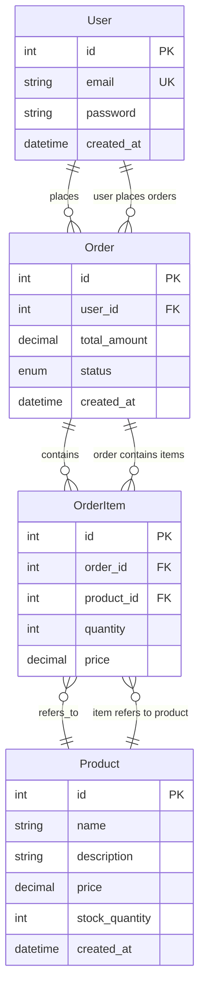

```mermaid
erDiagram
    User ||--o{ Order : places
    User {
        int id PK
        string email UK
        string password
        datetime created_at
    }

    Product {
        int id PK
        string name
        string description
        decimal price
        int stock_quantity
        datetime created_at
    }

    Order ||--o{ OrderItem : contains
    Order {
        int id PK
        int user_id FK
        decimal total_amount
        enum status
        datetime created_at
    }

    OrderItem }o--|| Product : refers_to
    OrderItem {
        int id PK
        int order_id FK
        int product_id FK
        int quantity
        decimal price
    }

    User ||--o{ Order : "user places orders"
    Order ||--o{ OrderItem : "order contains items"
    OrderItem }o--|| Product : "item refers to product"

```