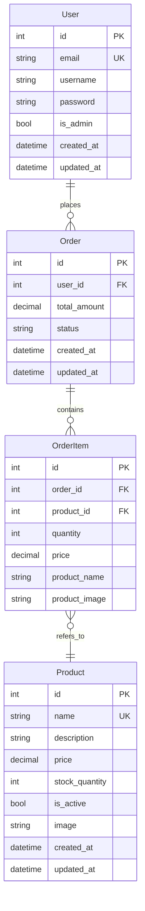

**User → Order**

- Um usuário pode realizar vários pedidos (1:N).

**Order → OrderItem**

- Um pedido pode conter vários itens (1:N).

**OrderItem → Product**

- Cada item do pedido refere-se a um único produto (N:1).

**Veja abaixo:**

