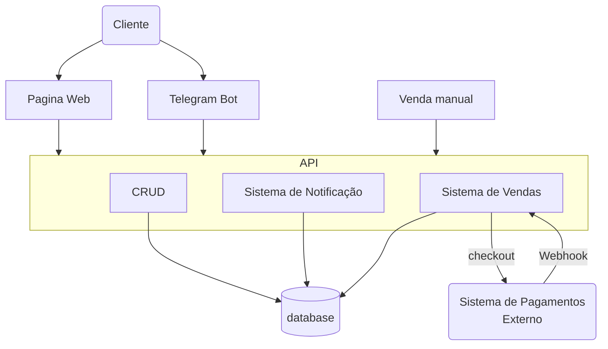

Diagrama do uso do software pelo cliente.

```mermaid
graph TD
    A(Cliente) --> B[Pagina Web]
    A --> C[Telegram Bot]
    
    subgraph app[API]
        app1[CRUD]
        app3[Sistema de Notificação]
        app2[Sistema de Vendas]
        
    end
    D[Venda manual] --> app
    B --> app
    C --> app
    app1 --> E[(database)]
    app2 --> E[(database)]
    app3 --> E[(database)]
    app2 --> |checkout| F(Sistema de Pagamentos 
    Externo)
    F --> |Webhook|app2
    
    


```