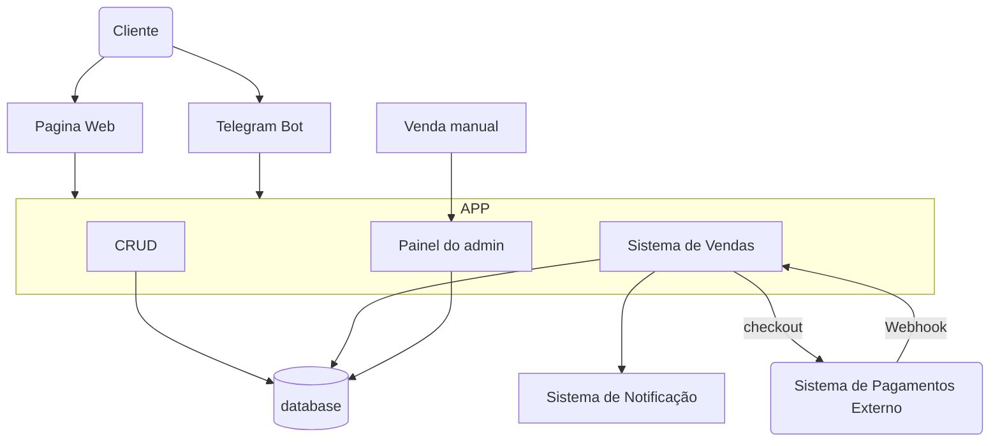

O usuario final tem acesso ao Sabores da terra de duas formas distintas:

  - Atraves da pagina web, onde possui os principais recursos como criação de conta, visualização do produtos, o carrinho de compras e o por fim a efetivação do pagamento.

  - Bot do telegram, onde é possivel visualizar os preços, o estoque, e a imagem do produto á venda em tempo real, alem de ter acesso ao link de redirecionamento da pagina web e da rede social.

O admin possui um painel administrativo, onde é possivel cadastrar vendas manuais, sendo assim o sistema centraliza todas as vendas realizadas.

Quando o usuario decidir realizar a compra, o checkout é acionado, e um link para um sistema de pagamentos externo com todos os items do pedido é criado, e o usuario é redirecionado.

Quando o pedido for pago, o sistema de pagamento envia um webhook para o sistema, então o status é definido como pago e um email é enviado ao admin como aviso.

**Veja abaixo o Diagrama do uso do software pelo cliente:**

