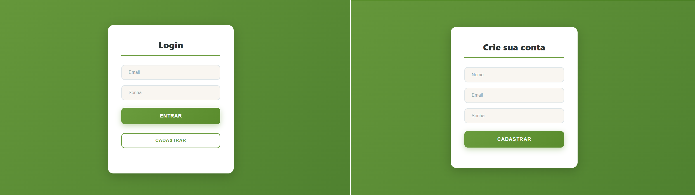
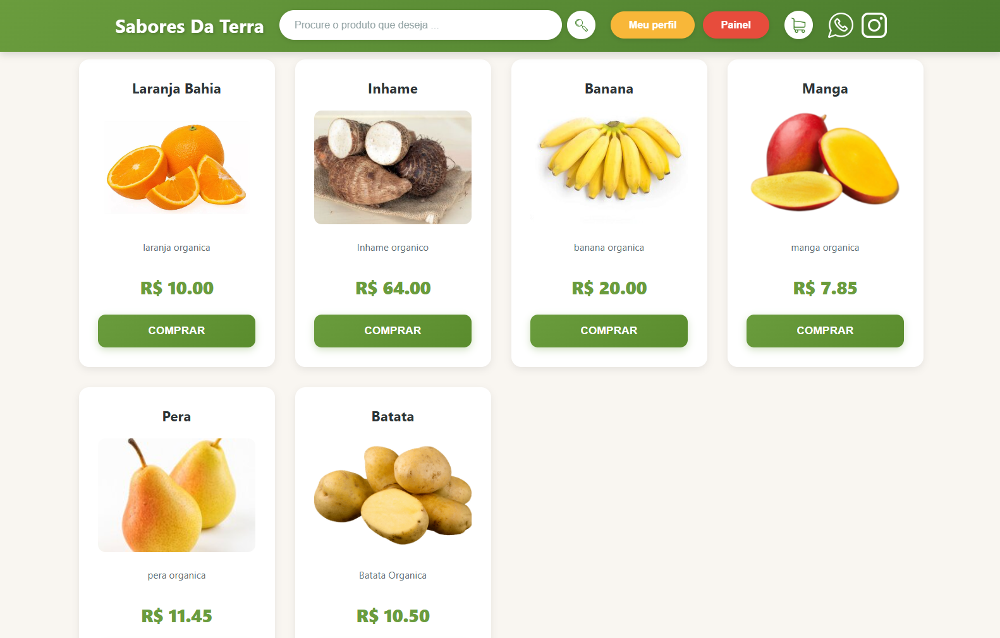
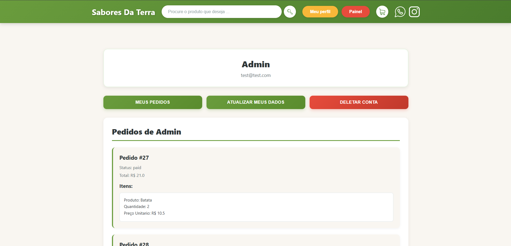
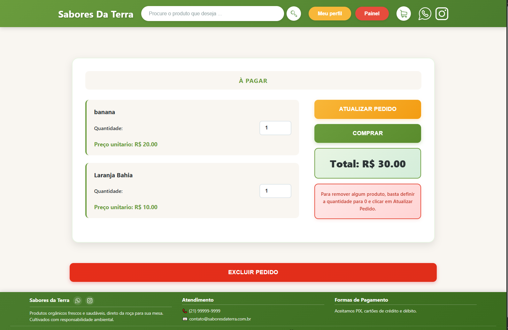
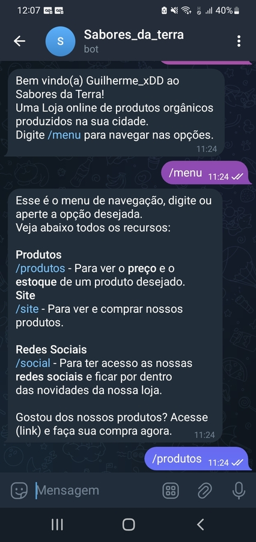

# Sobre o projeto

Bem vindo á documentação do Sabores da Terra, uma loja online de produtos orgânicos regionais.

## Pagina Web
A pagina web é a principal interface para o uso e o gerencianto da loja.

- Posui uma pagina de registro e login de clientes.
- Possui uma home page com os principais produtos e uma barra de pesquisa para encontrar o produto desejado.
- Cada produto possui sua propria pagina com todas as suas informações e um botão para adicionar o produto no carrinho de compras.
- O carrinho de compras mostra todos os items do pedido do cliente. Com a possibilidade de alterar items como desejar.
- O botão de compra redireciona o cliente para um sistema de pagamento externo.
- Um painel administrativo permite o admin, criar produtos, visualizar dados dos clientes e dos pedidos.

### Login e Cadastro

### Home Page

### Product Page

### Meu perfil

### Carrinho de compras

### Painel do Admin

## API
Sabores da Terra possui uma api moderna, desenvolvida com FastAPI.

- Possui gestão de clientes com Resgisto, alteração dos dados pessoais e exclusão de conta.
- Sistema seguro de autenticação baseado em tokens JWT.
- Possui 2 tipos de usuarios: comum e admin
- Getao de produtos pelo Admin: Cadastro de produtos para a venda, controle de estoque e alteraçao de preços, nome e descrição.
- Criação de Pedidos: Os clientes podem comprar varios produtos de uma vez, remover ou alterar a quantidade dos produtos individualmente a qualquer momento.
- Enpoints recebem e retornan Json, serializado e validado por contratos do Pydantic.

## Bot de Telegram - @Sabores_da_terra_bot
O bot de telegram permite qualquer pessoa sem login, visualizar os produtos em tempo real.

- O bot possui uma interface de utilização simples atravez de comandos. Por exemplo /menu.
- Tambem possui links de redirecionamento para a pagina web e para as redes socias da loja.

